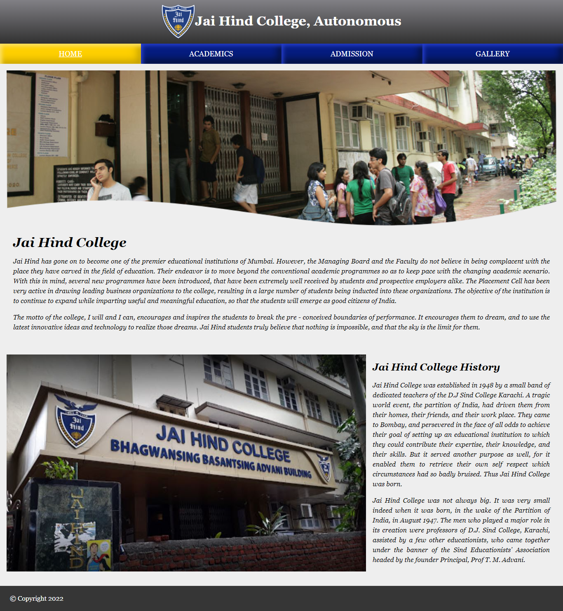
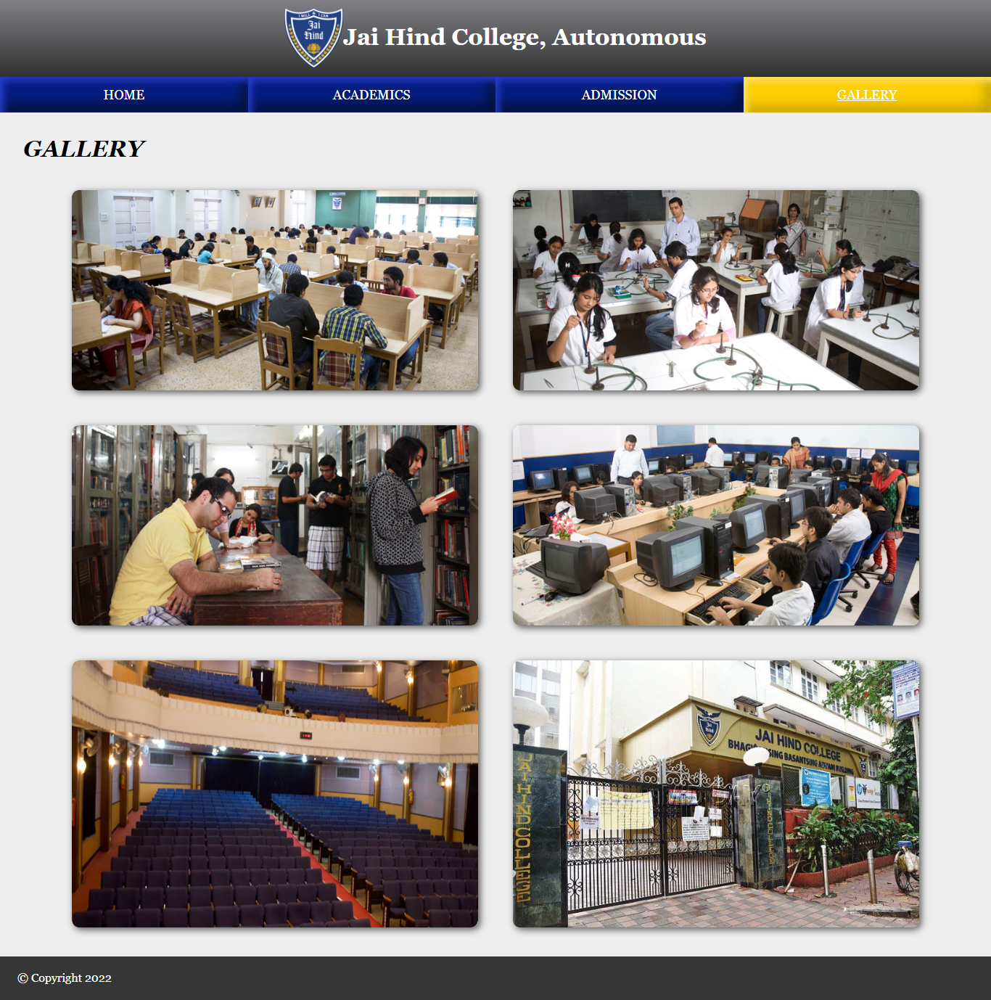

# College-Website
Visit to 
https://pilankar.github.io/College-Website
to view my portfolio
  

## Given Task

Design a website for a College. There should be at least 15 web-pages present in the web-site. There should be:
 
<ul>
<li>One Home page that leads to other pages. The Home page should contain the name of the
college as heading along with the college logo.There should be a tab with the following links:
<ul type="square">
<li>Home;</li>
<li>Academics;</li>
<li>Admission;</li>
<li>Gallery.</li>
</ul>
</li>

<li>There should be an appropriate description of the college on the home page.</li>
<li>One Academics page which contains a list of all the departments present in the college – Arts, Science and Commerce. The list should be a nested list, with available courses mentioned under each department. There should be a minimum of two courses under each department, (for e.g. Computer Science and Mathematics under Science, English and Sociology under Arts and so on). Each Course entry in the list should be a HTML link that leads to a web-page
totally dedicated to the course itself.</li>
<li> Each Course should have its own dedicated web-page. This page should contain a description about the course, a list of all the teachers taking the course and the timetable for that particular subject.</li>
<li>The Admission page basically contains a form that a student needs to fill up in order to take admission in the college. The form should ask all the necessary questions using appropriate form elements.</li>
<li>One gallery page that contains set of photos taken of the college and its students. Please note that each web-page in this website should have the same background Image/color. The looks of each page should be similar.</li>
</ul>

 

## Preview

